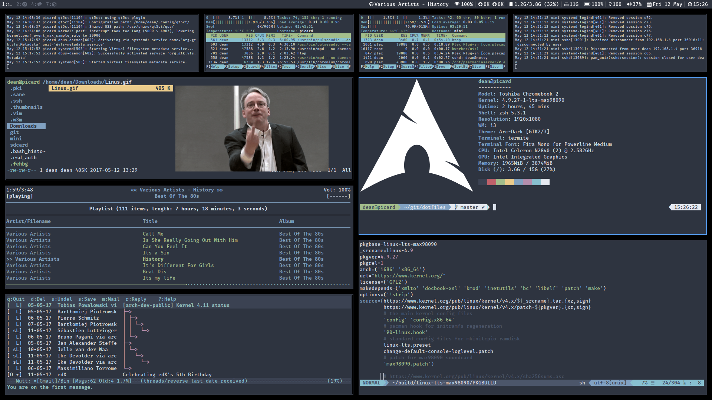

# :wrench: .files

_Simple snapshot of my dotfiles_

My setup is Archlinux with i3.  I have a remastered arch iso setup this way available at
https://drive.google.com/drive/folders/0B_M5BSg_FZkxV2RzWVlnR3M1a0U?usp=sharing

Also included so I don't have to make seperate repo's:

adblock.sh -  script that pulls hosts files from multiple url's and strips/sorts for usage with something like dnsmasq/pihole.

2gif - uses ffmpeg and gifsicle-lossy (AUR) to convert video to gif.  run '2gif' for parameters.

